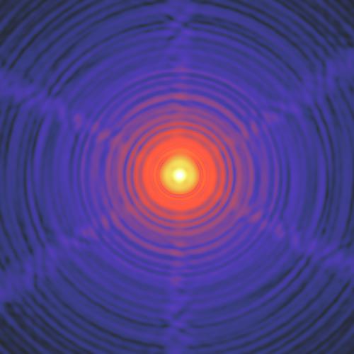

***************************************
PSF Homogenization kERnels - ``pypher``
***************************************

Compute an homogenization kernel between two PSFs

This code is well suited for PSF matching applications in both an astronomical or microscopy context.

It has been developed as part of the ESA Euclid_ mission and is currently being used for multi-band photometric studies of HST_ (visible) and Herschel_ (IR) data.

Features
========

1. **Warp** (rotation + resampling) the PSF images (if necessary),
2. **Filter** images in Fourier space using a regularized Wiener filter,
3. **Produce** a homogenization kernel.

**Note:** ``pypher`` needs the pixel scale information to be present in the FITS files. If not, use the provided ``addpixscl`` method to add this missing info.

.. warning:: This code **does not**    

    * interpolate NaN values (replaced by 0 instead),
    * center PSF images,
    * minimize the kernel size.

Quick setup
===========

In most cases the code can be installed via

.. code:: bash

    $ pip install pypher

and a kernel can then be produced from two PSFs with a simple command line

.. code:: bash

    $ pypher psf_a.fits psf_b.fits kernel_a_to_b.fits

Other installation procedures are described on the :ref:`installation page <installation>` and further command line options :ref:`here <usage>`.

User Guide
==========

.. toctree::
   :maxdepth: 2

   installation
   usage
   convenience
   contribution

Acknowledging
=============

If you make use of any product of this code in a scientific publication,
please consider acknowledging the work by citing the following paper

Boucaud *et al.* (2016) "Convolution kernels for multi-wavelength imaging"

.. note:: submitted to *Astronomy & Astrophysics* journal

----

:Author:
    Alexandre Boucaud 
:Email:
    alexandre.boucaud [at] ias.u-psud.fr
:Licence:
    This work is licensed under a 3-clause BSD license

----

.. _Euclid: http://www.cosmos.esa.int/web/euclid
.. _Herschel: http://www.cosmos.esa.int/web/herschel/home
.. _HST: https://www.spacetelescope.org/
.. _license: https://git.ias.u-psud.fr/aboucaud/pypher/blob/packaging/LICENSE
