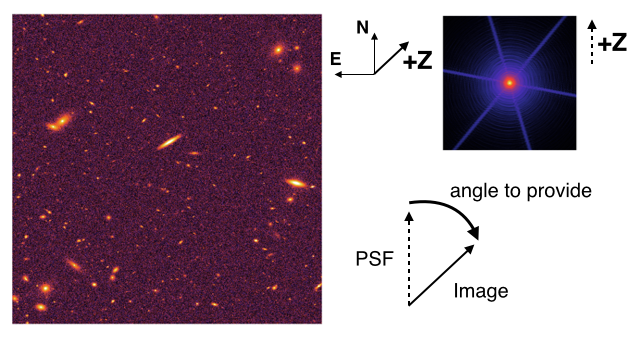

.. _usage:

===========================
Getting Started with pypher
===========================

Usage
=====

.. code:: bash

    $ pypher psf_source psf_target output 
                [-s ANGLE_SOURCE] [-t ANGLE_TARGET] [-r REG_FACT]
    $ pypher (-h | --help)

Arguments
---------

``psf_source`` (*str*)
    path to the high resolution PSF image (FITS file)
``psf_target`` (*str*)
    path to the low resolution PSF image (FITS file)
``output`` (*str*)
    output filename

Options
-------

``-h, --help``
    print help
``-r, --reg_fact`` (*float*)
    regularization factor (default 1.e-4)
``-s, --angle_source`` (*float*)
    rotation angle in degrees to apply to ``psf_source`` (default 0.0)
``-t, --angle_target`` (*float*)
    rotation angle in degrees to apply to ``psf_target`` (default 0.0)

Examples
========

The simplest example is the following

.. code:: bash

    $ pypher psf_a.fits psf_b.fits kernel_a_to_b.fits

This will create, using the default options values, the kernel ``kernel_a_to_b.fits`` and a short log ``kernel_a_to_b.log`` with information about the processing.

A more complex call would look like

.. code:: bash

    $ pypher psf_a.fits psf_b.fits kernel_a_to_b.fits -r 1.e-5 -s 27.45 -t 221.08

where the source and target angles are defined following the bottom :ref:`figure <fig-angle>`.

.. _regparm:

Regularization parameter
========================

Deconvolution of an image being an ill-posed problem, we stabilize the solution by using *regularization*. We chose to use a Wiener filter with a :math:`\ell_2` penalization which imposes a relative degree of smoothness between neighboring pixels.

If the image can be written as

.. math::

    y = \boldsymbol{H} x + n ,

the Wiener filter can be expressed as 

.. math::

    \frac{\boldsymbol{H}^{t}}{|\boldsymbol{H}|^2 + \lambda|\boldsymbol{D}|^2}

where :math:`\boldsymbol{H}` and :math:`\boldsymbol{D}` are, respectively, the convolution and the differential operators, and :math:`\lambda` is the regularization factor. This parameter creates a compromise between the fidelity to the data and the smoothness, and must therefore be tuned.

The **optimal value** for :math:`\lambda` (``--reg_fact``) **is the signal-to-noise ratio** :math:`S/N` of the image being deconvolved, *i.e.* the source image.

.. _angles:

Angle option
============

Because astronomical images may not be have been observed with the same orientation as the one of the PSF image, a rotation can be needed in order to create a kernel that is aligned with both the source image and target image orientation.

For this purpose, two optional parameters ``-s, --angle_source`` and ``-t, --angle_target`` can be provided to the code so it can rotate the PSFs before computing the kernel.

These angles are defined in a **clockwise** order, as shown in the figure below.

.. _fig-angle:

     
     Schematic of an image and its associated PSF with the reference direction of the telescope **+Z** and the angle definition.

.. warning:: **+Z** is not to be mistaken with neither the rotation angle nor the scanning angle
